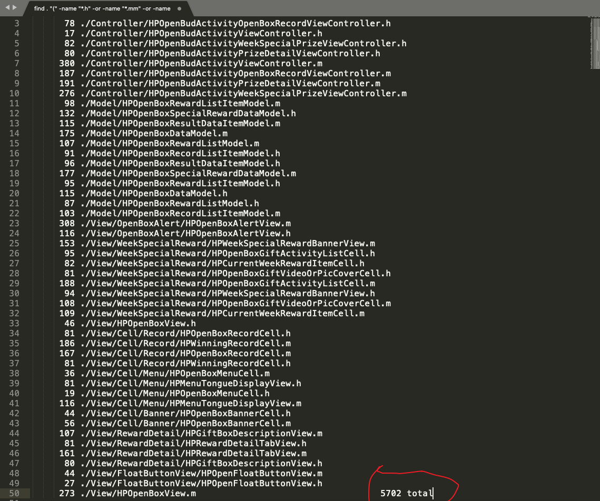

# WGBToolsConfigRepository

* [0. 点击finder上的图标即可快速跳转系统终端或者iTerm并cd至到当前目录下,该软件地址 <a href="https://zipzapmac.com/Go2Shell" rel="nofollow">https://zipzapmac.com/Go2Shell</a>](#0-点击finder上的图标即可快速跳转系统终端或者iterm并cd至到当前目录下该软件地址-httpszipzapmaccomgo2shell)
* [1. 配置Xcode主题,CoderWGB Theme.xccolortheme这个是我配置的,类似于sublime的风格, 配置之后肯定不想到了别的电脑上再配置一遍,很浪费时间的,毕竟时间就是命呐 !!!  Xcode主题文件的存放路径就在~/Library/Developer/Xcode/UserData/FontAndColorThemes/ ,打开找到对应你自己自定义的主题,拷贝出来即可给到别的电脑上使用,也是这个路径.](#1-配置xcode主题coderwgb-themexccolortheme这个是我配置的类似于sublime的风格-配置之后肯定不想到了别的电脑上再配置一遍很浪费时间的毕竟时间就是命呐---xcode主题文件的存放路径就在librarydeveloperxcodeuserdatafontandcolorthemes-打开找到对应你自己自定义的主题拷贝出来即可给到别的电脑上使用也是这个路径)
* [2. Xcode真机调试包的路径：/Applications/Xcode.app/Contents/Developer/Platforms/iPhoneOS.platform/DeviceSupport](#2-xcode真机调试包的路径applicationsxcodeappcontentsdeveloperplatformsiphoneosplatformdevicesupport)
* [3. 代码块 ~/Library/Developer/Xcode/UserData/CodeSnippets 平时收藏的代码块都是存放在这的, 所以换公司换电脑异或是家里公司代码块同步如同此法,把代码块文件放进这里,重新启动Xcode即可食用。](#3-代码块-librarydeveloperxcodeuserdatacodesnippets-平时收藏的代码块都是存放在这的-所以换公司换电脑异或是家里公司代码块同步如同此法把代码块文件放进这里重新启动xcode即可食用)
* [4. 显示Mac键盘操作动作指令的一个小工具 <a href="https://github.com/keycastr/keycastr">前往地址</a>](#4-显示mac键盘操作动作指令的一个小工具-前往地址)
* [5. 获取ipa文件里.car里的图片资源](#5-获取ipa文件里car里的图片资源)
* [6. Xcode热重载插件(目前只适用于模拟器),提高开发效率的工具InjectionIII（作者Xcode 10以上不再维护OC版本了）<a href="https://github.com/johnno1962/InjectionIII/releases">可使用最新的swift版本</a>](#6-xcode热重载插件目前只适用于模拟器提高开发效率的工具injectioniii作者xcode-10以上不再维护oc版本了可使用最新的swift版本)
* [7. 在线图片压缩工具<a href="https://imageoptim.com/mac" rel="nofollow">无损压缩工具imageoptim</a> 和 <a href="https://tinypng.com/" rel="nofollow">PNG压缩工具</a> 以及<a href="https://github.com/tinymind/LSUnusedResources">移除iOS项目无用图片工具</a>](#7-在线图片压缩工具无损压缩工具imageoptim-和-png压缩工具-以及移除ios项目无用图片工具)
* [8. <a href="https://www.json.cn/" rel="nofollow">json在线格式化工具</a> 和 <a href="http://modelend.com/" rel="nofollow">json转model在线工具</a>](#8-json在线格式化工具-和-json转model在线工具)
* [9. <a href="https://icon.wuruihong.com" rel="nofollow">给定一张1024x1024的大图一键生成app的logo</a>](#9-给定一张1024x1024的大图一键生成app的logo)
* [10. <a href="http://asciiflow.com/" rel="nofollow">在线绘制ASCi流程图</a>](#10-在线绘制asci流程图)
* [11. <a href="https://getkap.co/" rel="nofollow">一款不错免费录屏工具Kap</a>](#11-一款不错免费录屏工具kap)
* [12. <a href="http://coffeeipsum.com/" rel="nofollow">coffeeipsum</a> 一个自动生成英文文章的网站](#12-coffeeipsum-一个自动生成英文文章的网站)
* [13. 记录获取网络ip的两个地址 <a href="https://icanhazip.com" rel="nofollow">https://icanhazip.com</a> 和 <a href="http://ifconfig.me/ip" rel="nofollow">http://ifconfig.me/ip</a>](#13-记录获取网络ip的两个地址-httpsicanhazipcom-和-httpifconfigmeip)
* [14. 统计当前目录下(iOS)的代码行数的shell命令,搭配 <a href="https://zipzapmac.com/Go2Shell" rel="nofollow">Go2Shell</a>食用更佳](#14-统计当前目录下ios的代码行数的shell命令搭配-go2shell食用更佳)
* [15. 防止甩锅(<strong>git blame代码记录查询命令,blame字面意思是责怪，指责，怪...</strong>) 搭配 <a href="https://zipzapmac.com/Go2Shell" rel="nofollow">Go2Shell</a>食用更佳](#15-防止甩锅git-blame代码记录查询命令blame字面意思是责怪指责怪-搭配-go2shell食用更佳)
* [16. <a href="https://github.com/WangGuibin/WGBToolsConfigRepository/blob/master/Google书签/README.md"> 平时使用的Google书签 </a>](#16--平时使用的google书签-)
* [17. 一款统计键盘鼠标敲击次数的mac应用 <a href="https://zhuanlan.zhihu.com/p/21787949" rel="nofollow">中文教程</a>  <a href="https://github.com/KonsomeJona/OctoMouse/releases">下载地址</a>](#17-一款统计键盘鼠标敲击次数的mac应用-中文教程--下载地址)
* [18. 部署Xcode项目临时模板 点击 <a href="./自定义Xcode顶部描述信息/README.md">自定义Xcode顶部描述信息</a>](#18-部署xcode项目临时模板-点击-自定义xcode顶部描述信息)
* [19. <a href="https://github.com/WangGuibin/WGBToolsConfigRepository/blob/master/Shell/README.md">shell脚本集合</a>](#19-shell脚本集合)
* [20. <a href="https://github.com/avibrazil/RDM">Mac调整屏幕分辨率工具</a>](#20-mac调整屏幕分辨率工具)
* [21. <a href="https://www.wtfautolayout.com/" rel="nofollow">约束警告排查</a>](#21-约束警告排查)
* [22. <a href="https://docsify.js.org/#/zh-cn/quickstart" rel="nofollow">文档部署工具docsify</a>  需要repo本地根目录先创建docs文件夹,git-pages里的master branch/docs folder选项才能被选择 <a href="https://juejin.im/post/5b14b2f06fb9a01e5e3d3121" rel="nofollow">https://juejin.im/post/5b14b2f06fb9a01e5e3d3121</a>](#22-文档部署工具docsify--需要repo本地根目录先创建docs文件夹git-pages里的master-branchdocs-folder选项才能被选择-httpsjuejinimpost5b14b2f06fb9a01e5e3d3121)
* [23. <a href="https://github.com/dwarvesf/hidden">MacOS 状态栏隐藏工具</a>](#23-macos-状态栏隐藏工具)
* [24. <a href="https://github.com/WangGuibin/WGBToolsConfigRepository/blob/master/git使用记录/README.md">平时git使用的记录</a>](#24-平时git使用的记录)

Created by [gh-md-toc](https://github.com/ekalinin/github-markdown-toc)

平时可能会用上的一些效率工具及配置,存放于此 
(基于`Alfred`的`workflows`, `vim`的配置文件,`zsh`的配置文件,`Xcode`主题配置)

#### 0. 点击`finder`上的图标即可快速跳转系统终端或者`iTerm`并`cd`至到当前目录下,该软件地址 https://zipzapmac.com/Go2Shell

#### 1. 配置Xcode主题,`CoderWGB Theme.xccolortheme`这个是我配置的,类似于`sublime`的风格, 配置之后肯定不想到了别的电脑上再配置一遍,很浪费时间的,毕竟时间就是命呐 !!!  Xcode主题文件的存放路径就在`~/Library/Developer/Xcode/UserData/FontAndColorThemes/` ,打开找到对应你自己自定义的主题,拷贝出来即可给到别的电脑上使用,也是这个路径. 

#### 2. Xcode真机调试包的路径：`/Applications/Xcode.app/Contents/Developer/Platforms/iPhoneOS.platform/DeviceSupport` 
   [调试包资源](https://github.com/iGhibli/iOS-DeviceSupport) 或者 在`github`搜关键词`DeviceSupport` 
   [click me](https://github.com/search?utf8=%E2%9C%93&q=DeviceSupport&ref=simplesearch)

#### 3. 代码块 `~/Library/Developer/Xcode/UserData/CodeSnippets` 平时收藏的代码块都是存放在这的, 所以换公司换电脑异或是家里公司代码块同步如同此法,把代码块文件放进这里,重新启动`Xcode`即可食用。

#### 4. 显示Mac键盘操作动作指令的一个小工具 [前往地址](https://github.com/keycastr/keycastr) 

#### 5. 获取ipa文件里.car里的图片资源

a.   [cartool](<https://github.com/steventroughtonsmith/cartool>)   做个轮子用的人比较多,但是新版本的系统没有兼容,会crash之类的导致无法顺畅的使用,后来发现有网友修复了[查看#26](<https://github.com/steventroughtonsmith/cartool/pull/26/commits/93c1cedd304bb4b4ad987bb1be10e453536b9300>) , 需要加上一些代码兼容才能使用 (本仓库里有修复版本`cartool-master-fixed-Mojave-version`可以直接使用)

b. [AssetCatalogTinkerer](<https://github.com/insidegui/AssetCatalogTinkerer>) 这个轮子有人在维护,所以他目前是可以使用的, 傻瓜式的GUI,这个用起来比较爽,支持图片名模糊搜索,找到想要的直接拖拽出来,也可以批量全部导出, 但是唯一的缺点就是拖拽出来的图片.car里面还是会有一份,实际上是拖拽仅仅是拷贝出来的一份而已

#### 6. Xcode热重载插件(`目前只适用于模拟器`),提高开发效率的工具`InjectionIII`（作者Xcode 10以上不再维护OC版本了）[可使用最新的swift版本](https://github.com/johnno1962/InjectionIII/releases)

#### 7. 在线图片压缩工具[无损压缩工具imageoptim](https://imageoptim.com/mac) 和 [PNG压缩工具](https://tinypng.com/) 以及[移除iOS项目无用图片工具](https://github.com/tinymind/LSUnusedResources)

#### 8. [json在线格式化工具](https://www.json.cn/) 和 [json转model在线工具](http://modelend.com/)

#### 9. [给定一张1024x1024的大图一键生成app的logo](https://icon.wuruihong.com)

#### 10. [在线绘制ASCi流程图](http://asciiflow.com/) 

#### 11. [一款不错免费录屏工具Kap](https://getkap.co/) 
#### 12. [coffeeipsum](http://coffeeipsum.com/) 一个自动生成英文文章的网站
#### 13. 记录获取网络ip的两个地址 [https://icanhazip.com](https://icanhazip.com) 和 [http://ifconfig.me/ip](http://ifconfig.me/ip) 

示例

  <pre style="background-color:black;color:white;"> objc   NSURL *ipURL = [NSURL URLWithString:@"http://ifconfig.me/ip"];
    NSString *IPStr = [NSString stringWithContentsOfURL:ipURL encoding:NSUTF8StringEncoding error:nil]; 
</pre>

#### 14. 统计当前目录下(iOS)的代码行数的shell命令,搭配 [Go2Shell](https://zipzapmac.com/Go2Shell)食用更佳

查看命令

  <pre style="background-color:black;color:white;">    find . "(" -name "*.h" -or -name "*.mm" -or -name "*.m" -or -name "*.swift" ")" -print | xargs wc -l  
</pre>

#### 15. 防止甩锅(**`git blame`代码记录查询命令,`blame`字面意思是责怪，指责，怪...**) 搭配 [Go2Shell](https://zipzapmac.com/Go2Shell)食用更佳

查看命令

<pre style="background-color:black;color:white;">
   
  git blame -L 22,30 Example.m  # 替换具体的代码行数和文件名即可
   
</pre>

#### 16. [ 平时使用的Google书签 ](https://github.com/WangGuibin/WGBToolsConfigRepository/blob/master/Google%E4%B9%A6%E7%AD%BE/README.md)

#### 17. 一款统计键盘鼠标敲击次数的mac应用 [中文教程](https://zhuanlan.zhihu.com/p/21787949)  [下载地址](https://github.com/KonsomeJona/OctoMouse/releases) 

#### 18. 部署Xcode项目临时模板 点击 [自定义Xcode顶部描述信息](./自定义Xcode顶部描述信息/README.md)

#### 19. [shell脚本集合](https://github.com/WangGuibin/WGBToolsConfigRepository/blob/master/Shell/README.md)

#### 20. [Mac调整屏幕分辨率工具](https://github.com/avibrazil/RDM) 

#### 21. [约束警告排查](https://www.wtfautolayout.com/) 

#### 22. [文档部署工具docsify](https://docsify.js.org/#/zh-cn/quickstart)  需要repo本地根目录先创建docs文件夹,git-pages里的`master branch/docs folder`选项才能被选择 https://juejin.im/post/5b14b2f06fb9a01e5e3d3121 

#### 23. [MacOS 状态栏隐藏工具](https://github.com/dwarvesf/hidden)

#### 24. [平时git使用的记录](https://github.com/WangGuibin/WGBToolsConfigRepository/blob/master/git%E4%BD%BF%E7%94%A8%E8%AE%B0%E5%BD%95/README.md)

